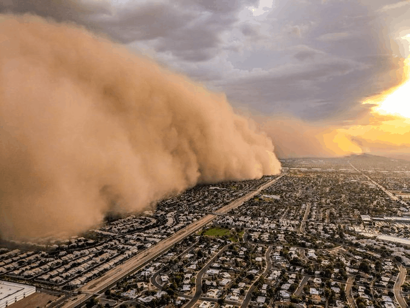

# Getting started
This project will introduce you to Oceananigans and explore the dynamics of gravity currents

To start, we need to install Oceananigans. To do this, open VS Code (if you don't already have it open). From the `File` menu, select `Open Folder...` and select the `FDSE` folder. To run the Julia REPL, select `View` and then `Command Palette` from the menu bar. Enter `Julia: Start REPL` and press enter. This should bring up a window in VS Code with a Julia prompt.

Julia has a fantastic built-in package manager for installing and updating add-on packages. Each of the projects has an environment which contains a list of the packages that will be needed for that project. To activate the required packages, follow these steps: 
1. Enter the package manager interface by pressing the `]` key. The `julia>` prompt should change to `pkg>` to indicate that the package manager is active.
2. Check that the newline in the interface begins `(FDSE) pkg> `, if not you need to type `activate ` followed by the relative path to the FDSE folder (i.e. if you are in it then `activate .`, or if you are in a `ProjectN` folder then `activate ..`.
3. Type `instantiate` and press return. (Note that if you don't already have the required packages installed on your computer, this step will take some time as the required packages are downloaded  and pre-compiled. However, this step should be very fast afterwards.)
4. Use the `delete` key to exit the package manager
5. Navigate to the project foler in the Julia REPL (e.g. type `cd("Project1")`)

Now we're ready to run Oceananigans! 🙌 To do this:
1. In the Explorer window of VS Code, navigate into the Project1 directory. If you don't see the FDSE folder, you can open it from GitHub Desktop using the Repository menu and selecting `Open in Visual Studio Code`
2. Double click on `gravitycurrent.jl`
3. Run the script by clicking on the right-pointing triangle to the right above the `gravitycurrent.jl` window

The model will run for 20 time units and print messages so that you can keep track of the progress. You can stop the model running at any time by pressing CONTROL-C, but if it isn't too slow, let the run finish. At the end of the simulation, the script will call `plot_gravitycurrent.jl` which will create a movie of the output called `gravitycurrent.mp4`. You should be able to open and view this movie in VS code, or you can open it with a movie player of your choice. A figure should also appear which shows the buoyancy evaluated at the bottom of the model domain as a function of distance in the x-direction and time.

Now that the code is running, we're ready to do some science! 🧪

# Introduction to Oceananigans 🌊
Although it was designed to simulate ocean physics, Oceananigans is a powerful general purpose computational fluid dyanmics (CFD) code. Here, we will use Oceananigans to explore the dynamics of gravity currents in the lock-release problem.

Oceananigans can solve equations in dimensional or non-dimensional form. In this project we will use it to solve the non-dimensional incompressible, Boussinesq equations, which can be written:
$$\frac{\partial \mathbf{u}}{\partial t}+\mathbf{u}\cdot \nabla \mathbf{u}=-\nabla p+\frac{1}{Re} \nabla^2\mathbf{u}+ Ri \hspace{2pt} b \hat{\mathbf{z}},$$
$$\frac{\partial b}{\partial t}+\mathbf{u}\cdot \nabla b = \frac{1}{Re Pr} \nabla^2 b,$$
$$\nabla\cdot \mathbf{u} = 0,$$
where $\mathbf{u}=(u,v,w)$ is the velocity vector and $\nabla=(\partial/\partial x,\partial/\partial y,\partial/\partial z)$. The variables have made non-dimensional using a length scale, $L$, velocity, $U_0$, and buoyancy, $B_0$. Note that the constant density, $\rho_0$, has been absorbed into the definition of the non-dimensional pressure, $p$. In this case, the non dimensional Reynolds, Richardson and Prandtl numbers are

$$Re\equiv \frac{U_0 L}{\nu}, \quad Ri\equiv \frac{B_0 L}{U_0^2} \quad \text{and} \quad Pr\equiv \frac{\nu}{\kappa},$$

and $\nu$ and $\kappa$ are the kinematic viscosity and molecular diffusivity, respectively. 

Have a look at `gravitycurrent.jl`.  It is extensively commented which should help you understand what is happening

Oceananigans scripts have several standard components:
1. Load any packages that will be needed in the script
2. Set the parameters that will be used for the model run
3. Build a model grid
4. Set the boundary and initial conditions
5. Create `model` and `simulation` objects
6. Define callbacks to call functions periodically during the simulation
7. Run the model
8. Process and plot the output

This structure will help get you started, but Oceanigans is very flexible in how you use it.

You can stop a simulation at any time by pressing CONTROL-C.  If you do this, the plotting script won't be called at the end, but you can run it yourself after you cancel the job.

# Gravity currents

Now, let's do some science and explore the dynamics of gravity currents using Oceananigans

Gravity currents develop when dense fluid flows beneath light fluid under the effect of gravity.
The image below shows a dramatic example of a gravity current known as a 'haboob' where sand and dust is picked up by strong winds associated with a weather front.

A simple way to model gravity currents is using a 'lock-exchange' flow. In the laboratory, dense fluid would be separated from light fluid by a vertical barrier. After the barrier is removed, the dense fluid will flow along the bottom of the tank with a height $H$. [Shin et al.](./papers/ShinDalzielLinden.pdf) discuss laboratory experiments of gravity currents arising from the 'lock-exchange' problem.

We can simulate the lock-exchange problem by initializing the buoyancy using the step-like tanh function. The initial velocity is typically zero, but we might want to add some small random noise to the velocity field to help trigger turbuelence.

In `gravitycurrent.jl`, the equations are non-dimensionalized using the vertical domain height and the change in buoyancy, $\Delta b=-g \Delta \rho / \rho_0$, where $\Delta \rho$ characterizes the initial density jump. The domain size is 10 non-dimensional units in the $x$-direction and 1 unit (by definition) in the $z$-direction. The Reynolds and Prandtl numbers are set to 5000 and 1, respectively, and we use $Nx=256$ and $Nz=32$ gridpoints in the x and z directions, respectively. You might want to take some time to change these parameters to get a feel for the flow and for how the model performs. 

Based on scaling arguments, a semi-infinite gravity current should propagate at a speed U, where

$$U \sim \sqrt{\Delta b H},$$

$\Delta b$ is the buoyancy difference between the gravity current and the ambient fluid, and $H$ is the gravity current height. Try running `gravitycurrent.jl` for several different values of $\Delta b$, and calculate the propagation speed in each case. Does the scaling law hold? Can you think of ways to test this relation quantitatively?

# Suggested further investigations

Each project will have some suggestions for further investigations at the end. Don't worry if you don't have time to do these. In the last computing session, your group will have time to do some of these futher investigations (or think of your own!) and make a presentation to show to the group on the final day of the summer school. These extensions will require some modification to `gravitycurrent.jl`, and you might want to copy and rename that script before you start editing.

## Colliding gravity currents

A sea breeze is another example of a gravity current. As the air over land heats up during the day it becomes less dense than air over cool ocean waters. The relative dense marine air then moves onto land in the form of a sea breeze. Over small land features (e.g. islands or penninsulas) sea breezes can propagate towards the center of the land mass from multiple sides and collide in the middle. This can generate vigorous updrafts and rain. [van der Wiel et al.](./papers/vanderWielEtAl.pdf) used laboratory experiments to study this pheonomenon. Try reproducing this phenomena in Oceananigans. Can you predict the maximum height that the gravity currents can reach after they collide using an energy argument? What happens when the buoyancy (density) of the two gravity currents is different?

## Gravity currents in stable stratification

Try repeating the gravity current experiments, but start with a stable buoyancy profile in the ambient fluid. Start out with a case where the density of the fluid to the left of the 'lock' is equal to the densest fluid in the ambient. Can you detect internal waves propagating in the ambient fluid ahead of the gravity current? To do this, you may need to reduce the width of the lock or make the domain larger in $x$. It also might be helpful to create a second, passive tracer and use it to 'dye' the fluid in the lock to track the gravity current. Try varying the density in the fluid in the lock in relation to the minimum and maximum buoyancy in the stratified ambient. For example, what happens when the lock fluid has the same density as the average of the ambient fluid?

## Gravity currents on a slope

Oceananigans gives us control of the direction in which gravity points. By changing the angle of gravity in the (x,z) plane, we can use this to simulate a gravity current on a prograde or retrograde slope. To do this, add a definition of the variable `gravity_unit_vector` in the call to Buoyancy when `model` is defined. Note that the plots that are made in `plot_gravitycurrent.jl` will be in a tilted reference frame aligned with the computational domain. How does the tile angle influence the speed of the gravity current? 

