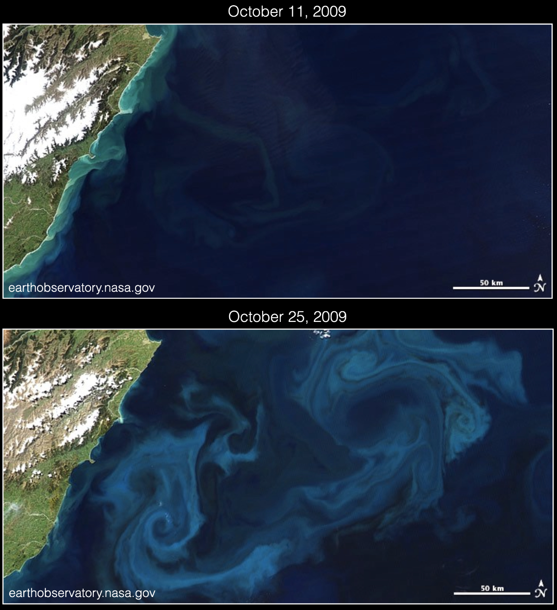

# Ocean ecosystem dynamics

Microscopic algae called phytoplankton form the foundation of the ocean's food web and are responsible for about half of the primary production (photosynthesis) on the earth.
When conditions are favorable, phytoplankton often appear in rapid growth events called blooms, but they can also die out quickly when their growth is limited by nutrients or grazing by predators called zooplankton.
This is illustrated in the figure below which shows two quasi true-color satellite images of the New Zealand coastline, separated by about two weeks. In the second image, a dramatic phytoplankton bloom has changed the color of the water and revealing swirling ocean eddies.



Fluid dynamics has a very strong influence on phytoplankton (and hence the global carbon cycle). Sunlight needed for photosynthesis illuminates a relatively thin layer of the upper ocean. When phytoplankton are advected into the dark ocean interior for extended periods of time, they will become dormant or die. Different populations of phytoplankton, the nutrients that they rely on, and their predators are co-mingled and mixed by ocean currents.

This project will use [OceanBioME.jl](https://github.com/OceanBioME/OceanBioME.jl) (Ocean Biogeochemical Modelling Environment), a Julia package developed in the DAMTP Ocean Dynamics group at Cambridge to provide biogeochemical models for Oceananigans. OceanBioME has powerful features including state-of-the-art biogeochemical models, models for the air-sea gas exchange, sediment models, and biologically-active particles. Here, we will use OceanBioME to provide a model of the predator-prey dynamics of a population of phytoplankton and zooplankton. We will then use Oceananigans to explore how advection and diffusion modifies the intrinsic ecosystem dynamics.

OceanBioME is included in the FDSE project environment, so if you type `activate .` and `instantiate` in the Julia package manager starting from the FDSE folder, you will already have it installed.  If you have installed the packages manually, you will need to install OceanBioME using the package manager. From the Julia REPL (command prompt), type `]`, followed by `add OceanBiome`. Once the package installs, return to the command prompt using the `delete` key.

# 0-dimensional 'box' model
Although OceanBioME is primarily intended to be coupled with Oceananigans, it can be used on its own to integrate the equations describing the dynamics of the ocean ecosystem. This is useful for developing an understanding of the intrinsic ecosystem dynamics, before adding the complications of fluid dynamics, and for debugging new models. 

The evolving populations of phytoplankton and zooplankton can be modeled as a predator-prey system. A classic formulation of this is known as the Lotka-Volterra equations, which can be written
$$\frac{dP}{dt}=\alpha P-\beta P Z, $$
$$\frac{dZ}{dt} = \delta \beta P Z - \gamma Z,$$
where $P$ and $Z$ are the concentrations of phytoplankton and zooplankton, respectively. The constants in the model are the phytoplankton growth rate, $\alpha$, the grazing rate, $\beta$, the grazing efficiency, $\delta$, and the zooplankton mortality rate, $\gamma$. These equations are implemented in `PZ.jl`. You shouldn't need to edit this file unless you want to change the form of the equations that are being considered. Default values of the parameters are set in this file, but you can also set these parameters when you run the model. Note also that the phytoplankton growth rate is modified by a depth-dependent function to mimic the level of light exposure. This will be used in the following sections and has no impact on the box model (where the depth is z=0 by default).

The equations above can be solved numerically by running `PZ_box.jl`. Try running this script and watch the movie that it generates. The system has two fixed points (one with P=0, Z=0) and exhibits oscillatory behavior where the population of the predators lags the population of the prey. If you aren't already familiar with the Lotka-Volterra equations, you might find it helpful to gain some insight into the system by varying the model parameters. In particular, try varying the phytoplankoton growth rate, $\alpha$, and pay attention to how this parameter influences the amplitude and frequency of the oscillations. This will help you interpret the results in the next two sections.

# 1-dimensional 'column' model

The growth rate of phytoplankton is set, in part, by the level of available light. As a result, the phytoplankton growth rate is a function of depth. A simple way to model this is by multiplying the growth rate by an exponential function that decays with depth. Based on your insights from the previous section, how do you expect the frequency of oscillations of the system to vary with depth?

The file `PZ_column.jl` uses Oceananigans to integrate a 1-dimensional 'column' model. Here, the velocity is zero, but an optional diffusivity can be added to the equations governing $P$ and $Z$ (but initially the diffusivity is set to zero). The growth rate is also now a function of depth in the system, with the e-folding depth set by the parameter `light_decay_length`. Try running `PZ_column.jl`. Are the results consistent with your expectations?  Are there any features of the solution that you didn't expect?

Based on the space-time diagram that you get from `PZ_column.jl`, what do you expect to happen when diffusion is added to the system?  Try changing the diffusion coefficient set inside `PZ_column.jl` and run the model again (a good value to start with is $\kappa_t$ = 1e-4). What does this do to the oscillations?  Try varying the diffusivity, $\kappa_t$, the `phytoplankton_growth_rate`, and or `light_decay_length`. 

# 2-dimensional model of lid-driven cavity circulation

Now, we will explore the influence of advection on the dynamics of the phytoplankton/zooplankton system with a depth-dependent phytoplankton growth rate. In the ocean, vertical currents have a strong influence on phytoplankton growth by transporting phytoplankton from the surface into the dark ocean interior, or by upwelling nutrient-rich waters into the sunlit layer.

The script `PZ_cavity.jl` solves the predator-prey system described above for 2D lid-driven cavity flow. Here, the boundary condition at the top wall is $u=1$, $w=0$ and all other boundaries have no-slip boundary conditions. By default, the tracers ($P$ and $Z$) have no flux conditions applied at all boundaries. 

Try running `PZ_cavity.jl`, which will produce a movie of the evolution of the velocity components and the phytoplankton and zooplankton concentration. Can you see any evidence of the intrinsic ecosystem dynamics in the evolution of P and Z?  

Consider the timescales involved in this system associated with advection, diffusion, and predator-prey oscillations. You might also find it useful to define appropriate non-dimensional numbers. Try varying some parameters in the model to explore other parts of parameter space (i.e. where the non-dimensional numbers are small or large). Note that lid-driven cavity flow is sensitive to the resolution, and you might find that increasing the lid velocity without increasing the grid spacing will result in numerical instabilities (but it should be safe to decrease the lid velocity). 

# Suggested further investigations

## Buoyant / sinking phytoplankton
Often phytoplankton cells are slightly more or less dense than the surrounding seawater, causing them to slowly sink or rise in the absence of vertical currents. There is a parameter in `PZ.jl` called `sinking_velocity` which causes the phytoplankton to rise or sink with a prescribed vertical velocity relative to the surrounding water (note that positive values of the parameter correspond to rising motion and negative values correspond to sinking motion). Try changing this parameter and explore the consequences on the predator-prey system. You can explore the effect of this change both in `PZ_column.jl` and `PZ_cavity.jl`. Note that you might need to reduce the size of the timestep to prevent numerical instabilities.

Note that in order to conserve total phytoplankton in our domain, it necessary to define the sinking velocity so that it goes to zero at the top and bottom boundaries. To do this, we can use a function field so that the sinking velocity will be a function of space. For example:
```julia
λ = 0.1
w₀ = 0.05

w_sinking(x, y, z, params) = - params.w₀ * (tanh(z/params.λ) - tanh((-z - 1)/params.λ) - 1)

sinking_velocity = Oceananigans.Fields.FunctionField{Center, Center, Center}(w_sinking, grid; parameters = (; λ, w₀))
```

## PZ model formulation
Many different mathematical formulations have been proposed for ocean ecosystem dynamics. The model implemented in `PZ.jl` is arguably the simplest possible predator-prey model, but many other choices are possible. For example, an additional loss term is often added to the zooplankton equation in the form $-\epsilon Z^2$ to represent grazing of zooplankton by other zooplankton, where $\epsilon$ is a constant. The grazing term is also often nonlinear in the phytoplankoton concentration (say quadratic with $-\beta P^2 Z$) to account for the difficulty for zooplankton to graze at very low prey densities. Try modifying `PZ.jl` to alter the system and repeat some of the steps above to explore the sensitivity of the results to the choice of the PZ model formulation. You might find this paper by [Franks](./papers/Franks2002.pdf) useful for ideas for other model formulations and an explanation for some of the rationale behind them.

## NPZD model (ambitious)
OceanBioME includes more complicated biogeochemical models and makes it relatively easy to switch between models. You might find it interesting to try a more realistic and complex biogeochemical model. For example, a four-component Nutrient-Phytoplankton-Zooplankton-Detritus model is described [here](https://oceanbiome.github.io/OceanBioME.jl/stable/model_components/biogeochemical/NPZ/). You can follow the implemention used [here](https://oceanbiome.github.io/OceanBioME.jl/stable/).


